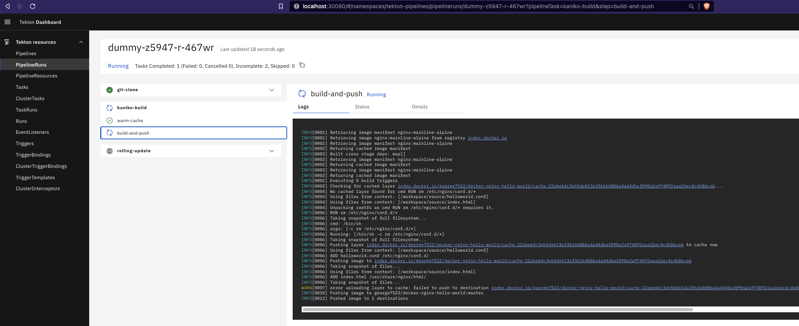
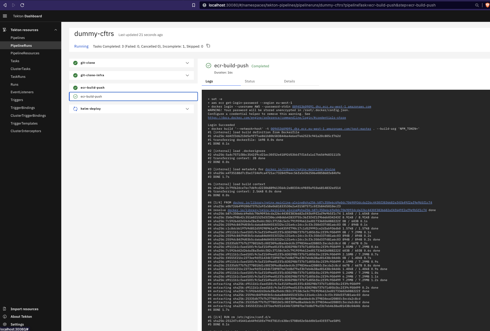

# Tekton Helm Chart - Kubernetes CI/CD Pipelines Made Easy

[](https://cogitogroupltd.github.io/tekton-helm-chart)
[](https://tekton.dev)
[](LICENSE)

**Production-ready Tekton Helm Chart for Kubernetes CI/CD Pipelines**

Deploy enterprise-grade [Tekton](https://tekton.dev) CI/CD pipelines on Kubernetes with a single Helm command. This official Tekton Helm chart from [Cogito Group Ltd](https://cogitogroup.co.uk) simplifies Tekton pipeline deployment across all major Kubernetes distributions.

**This Helm chart is still in development**

> Copyright [2024] [Cogito Group Ltd]

## Why Choose This Tekton Helm Chart?

This **Tekton Helm Chart** repository provides production-ready configuration for deploying Tekton CI/CD pipelines on any Kubernetes cluster. Unlike other Tekton deployment methods, this Helm chart offers:

- **One-Command Deployment**: Install complete Tekton pipelines with a single `helm install` command
- **Multi-Platform Support**: Works on EKS, AKS, GKE, OpenShift, K3s, MicroK8s, Kind, and more
- **GitHub Webhook Automation**: Built-in webhook creation and management from within Tekton
- **Security-First Design**: Least-privilege RBAC with isolated permissions per task
- **Container Build Options**: Pre-configured support for Kaniko, Buildah, and Docker-in-Docker

This Tekton Helm chart is platform-agnostic and Kubernetes distribution-agnostic. The chart does not install Tekton CRDs - install those separately following our [Tekton installation guide](./docs/installing_tekton.md).

**Repository**: https://github.com/cogitogroupltd/tekton-helm-chart
**Helm Repository**: https://cogitogroupltd.github.io/tekton-helm-chart

## Quick Start - Install Tekton with Helm

```bash
# Add the Tekton Helm chart repository
helm repo add tekton https://cogitogroupltd.github.io/tekton-helm-chart
helm repo update tekton

# Install Tekton pipelines using Helm
helm install my-tekton-pipeline tekton/pipeline
```

See detailed [installation examples](#Examples) below for complete CI/CD pipeline configurations.


 
<!-- vscode-markdown-toc -->
* 1. [Summary](#Summary)
* 2. [Examples](#Examples)
	* 2.1. [Simple Kaniko Pipeline Example](#SimpleKanikoPipelineExample)
	* 2.2. [Simple Buildah Pipeline Example](#SimpleBuildahPipelineExample)
	* 2.3. [Simple Docker-in-docker Pipeline Example (not recommended)](#SimpleDocker-in-dockerPipelineExamplenotrecommended)
* 3. [Todo](#Todo)
* 4. [Troubleshooting](#Troubleshooting)

<!-- vscode-markdown-toc-config
	numbering=true
	autoSave=true
	/vscode-markdown-toc-config -->
<!-- /vscode-markdown-toc -->

##  1. <a name='Summary'></a>Tekton Helm Chart Features & Capabilities

**This project is in development and should not be used in production**

This **Tekton Helm Chart** provides comprehensive Kubernetes CI/CD automation with Tekton pipelines, offering everything you need for production Tekton deployments.

###  1.1. <a name='Features'></a>Key Features of This Tekton Helm Chart

- **Complete Tekton Deployment**: Helm chart deploys all Tekton pipeline resources and dependencies (except Tekton CRDs)
- **Simplified Tekton Integration**: Automated Tekton resource linking for streamlined developer experience
- **GitOps-Ready Tekton Pipelines**: Declarative and immutable Tekton pipeline definitions
- **Secure Tekton Execution**: Least-privilege RBAC model with isolated permissions for each Tekton task run
- **GitHub Webhook Automation**: Create and delete GitHub webhooks directly from Tekton pipelines
- **Flexible Tekton Triggers**: Trigger Tekton pipelines via CronJob schedules or GitHub webhook events
- **Multi-Architecture Support**: Tekton Helm chart works on ARM64 and AMD64 architectures


###  1.2. <a name='Successfullytestedon'></a>Tekton Helm Chart Compatibility - Tested Kubernetes Platforms

- CPU Architectures; arm64 (MacM1, MacM2), amd64
- AWS EKS version == v1.30
- OpenShift ROSA (OKD4) v1.28 - v1.30
- Openshift OKD3 - v1.28 - v1.30
- Kind [download](https://kind.sigs.k8s.io/) version == v1.29, v1.30
- Microk8s version == v1.30
- Rancher K3s == v1.30
- Azure AKS == 1.30
- Google Kubernetes Engine (GKE)

###  1.3. <a name='Prerequisties'></a>Prerequisties

Before deploying the Helm chart the below steps are required:

- Kubernetes cluster >= v1.28, see [kind.md](./docs/kind.md).
- Kubectl > v1.25 [https://kubernetes.io/docs/tasks/tools/](https://kubernetes.io/docs/tasks/tools/). Only required to execute a `pipelineRun`. See [Pre Requisities](./docs/prereqs.md) for an example install script
- Helm > v3.0 [https://helm.sh/docs/intro/install/](https://helm.sh/docs/intro/install/). Required to deploy the Tekton pipelines in this Helm chart. See [Pre Requisities](./docs/prereqs.md) for an example install script
- Install Tekton, see [Installing Tekton](./docs/installing_tekton.md). Required dependency to deploy the Tekton pipelines in this Helm chart.
- SSH RSA Keypair linked with Github with **no passphrase**, see [Generate RSA](./docs/generate_rsa.md) for how to generate. If you already have one then great, this will be required for all examples.
- AWS CLI > v2.0 - Required to deploy the Tekton pipelines in this Helm chart.
- DockerHub username and password - required for examples using Dockerhub


##  2. <a name='Examples'></a>Tekton Helm Chart Examples - CI/CD Pipeline Tutorials

Install the Tekton Helm chart repository:

```bash
helm repo add tekton https://cogitogroupltd.github.io/tekton-helm-chart
helm repo update tekton
```

Listed below are complete examples demonstrating how to use this Tekton Helm chart for common Kubernetes CI/CD tasks and DevOps workflows. 


###  2.1. <a name='SimpleKanikoPipelineExample'></a>Tekton Helm Chart Example: Kaniko Container Build Pipeline

Deploy a complete Tekton CI/CD pipeline using [Kaniko](https://github.com/GoogleContainerTools/kaniko) for secure, daemonless container image builds on Kubernetes. Kaniko operates without needing a Docker daemon, builds container images without requiring root privileges, and is more resource-efficient for building images in Kubernetes as it operates as a single container process.

See example [README.md](./examples/kaniko-build-deploy/README.md)



###  2.2. <a name='SimpleBuildahPipelineExample'></a>Tekton Helm Chart Example: Buildah Container Build Pipeline

Configure Tekton pipelines with [Buildah](https://buildah.io/) for rootless container image builds on Kubernetes. Buildah is designed to be lightweight and operates without a long-running daemon, unlike Docker. This is beneficial when running inside a Kubernetes container, providing a streamlined and efficient toolchain. Buildah allows granular control over the image creation process and builds images without requiring root privileges or the Docker daemon.


See example [README.md](./examples/buildah-build-deploy/README.md)


###  2.3. <a name='SimpleDocker-in-dockerPipelineExamplenotrecommended'></a>Tekton Helm Chart Example: Docker-in-Docker Pipeline (Educational Purpose)

This is for just for fun. Running docker-in-docker is not recommended due to security vulnerabilities and the Docker daemon is now deprecated on Kubernetes. Here we mount the docker.sock and local docker image cache into the Kubernetes hosted docker container, to build source code using native docker commands. 

See example [README.md](./examples/dind-ecr-build-deploy/README.md)





##  3. <a name='Todo'></a>Todo

- [ ] Allow multiple installations of helm chart into same cluster; currently conflicts when ClusteRoles and ClusterRoleBindings are not unique
- [ ] Helm not correctly reconciling Task definition updates, despite 
- [ ] Remove hard coding in triggerTemplate by moving all built-in tasks to use an array same as calling a global custom task
- [ ] Add docs on taskPodTemplate vs podTemplate whereby a taskPodTemplate overrides the podTemplate
- [ ] Examples - Incorporate usage of eks.role.arn annotations to demonstrate easy utilisation of lease privilege
- [ ] Allow multiple installations of helm chart into same namespace; currently conflicts when task names are not unique
- [ ] Move resource defs from eventListener
- [ ] Remove dependency on cluster-admin ClusterRole by creating a new tekton-cluster-admin ClusterRole
- [ ] Documentation for Windows
- [ ] Auto generate dynamic \_taskRun.yaml for custom-task in helm output via Notes.txt
- [ ] Auto generate a dynamic \_pipelineRun.yaml for each pipeline in helm output via Notes.txt
- [ ] Add `taskcall[0].steps` to override `taskdefinition[0].steps` so that a developer can use the same task but have the steps overridden. This fix requires dynamic task creation in the background and hence post-pended GUID mapping.

More feature requests? Please raise a github [issue](https://github.com/cogitogroupltd/tekton-helm-chart/issues)

##  4. <a name='Troubleshooting'></a>Troubleshooting

See [FAQ.md](./docs/FAQ.md) or our [blog](https://cogitogroup.co.uk/blog)

## Contributing & Support

### How to Contribute to This Tekton Helm Chart

We welcome contributions to improve this Tekton Helm Chart! To contribute:

1. Fork the repository
2. Create a feature branch (`git checkout -b feature/amazing-feature`)
3. Commit your changes (`git commit -m 'Add amazing feature'`)
4. Push to the branch (`git push origin feature/amazing-feature`)
5. Open a Pull Request

### Get Help with Tekton Helm Chart

- **Issues**: [GitHub Issues](https://github.com/cogitogroupltd/tekton-helm-chart/issues)
- **Documentation**: [docs/](./docs/)
- **Examples**: [examples/](./examples/)
- **Blog**: [Cogito Group Blog](https://cogitogroup.co.uk/blog)

### Stay Updated

- **Star this repository** to receive updates about new Tekton Helm chart features
- **Watch releases** for notifications about new versions
- Follow [Cogito Group](https://cogitogroup.co.uk) for Tekton and Kubernetes insights

## Related Projects & Resources

- [Tekton Official Documentation](https://tekton.dev)
- [Tekton Pipelines GitHub](https://github.com/tektoncd/pipeline)
- [Tekton Triggers](https://github.com/tektoncd/triggers)
- [Tekton Catalog](https://github.com/tektoncd/catalog)
- [Helm Documentation](https://helm.sh/docs/)

## Changelog

See [CHANGELOG.md](./CHANGELOG.md) for version history and release notes.

## License

This Tekton Helm Chart is licensed under the terms specified in the [LICENSE](./LICENSE) file.

Copyright [2024] [Cogito Group Ltd]

---

**Keywords**: Tekton, Helm Chart, Kubernetes CI/CD, Tekton Pipelines, Kubernetes, DevOps, Continuous Integration, Continuous Deployment, Kaniko, Buildah, GitHub Webhooks, Tekton Triggers, Cloud Native, GitOps, Pipeline Automation
