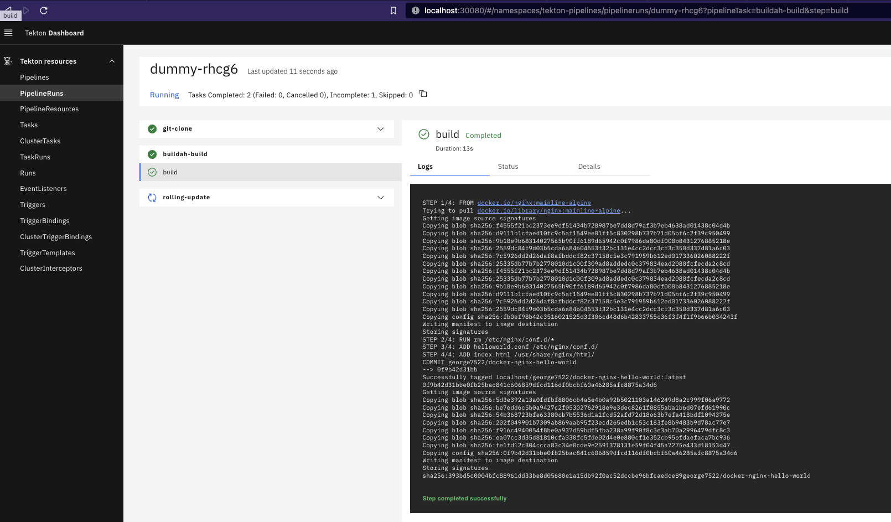

# Helm chart for installing Tekton pipelines

[Cogito Group's](https://cogitogroup.co.uk) cloud agnostic and generic Tekton Helm chart to install CI/CD pipelines ontop of Kubernetes with **one** command. 

Source repository https://github.com/cogitogroupltd/tekton-helm-chart


<!-- vscode-markdown-toc -->
1. [Summary](#Summary)
	* 1.1. [Features](#Features)
	* 1.2. [Successfully tested on](#Successfullytestedon)
	* 1.3. [PreRequisties](#PreRequisties)
	* 1.4. [Install Tekton](#InstallTekton)
2. [Install pipelines examples](#Installpipelinesexamples)
	* 2.1. [Example 1 - Clone, build and push docker image to ECR using Docker-in-docker](#Example1-ClonebuildandpushdockerimagetoECRusingDocker-in-docker)
	* 2.2. [Example 2 - Clone, build and push docker image to Dockerhub using Kaniko](#Example2-ClonebuildandpushdockerimagetoDockerhubusingKaniko)
	* 2.3. [Example 3 - Clone, build and push docker image to Dockerhub using Buildah](#Example3-ClonebuildandpushdockerimagetoDockerhubusingBuildah)
3. [Todo](#Todo)
4. [Troubleshooting](#Troubleshooting)

<!-- vscode-markdown-toc-config
	numbering=true
	autoSave=true
	/vscode-markdown-toc-config -->
<!-- /vscode-markdown-toc -->


##  1. <a name='Summary'></a>Summary


###  1.1. <a name='Features'></a>Features

- Values.yaml driven pipeline development 
- Dynamic task generation
- Least-privilege with isolated permissions for each task run
- Create/Delete Github webhook tasks


###  1.2. <a name='Successfullytestedon'></a>Successfully tested on

 - AWS EKS > v1.22
 - OpenShift ROSA (OKD4)
 - Openshift OKD3
 - Kind [download](https://kind.sigs.k8s.io/) > v1.22
 - Microk8s
 - Rancher K3s 
 - Google Kubernetes Engine (GKE)


###  1.3. <a name='PreRequisties'></a>PreRequisties 

In order to install the Tekton Helm chart you will need a Kubernetes cluster > v1.22 and the below tools

- Kubernetes cluster (optional, see [kind.md](./docs/kind.md) for deploying a local Kind cluster)
- Kubectl > v1.22 [https://kubernetes.io/docs/tasks/tools/](https://kubernetes.io/docs/tasks/tools/)
- Helm > v3.0 [https://helm.sh/docs/intro/install/](https://helm.sh/docs/intro/install/)
- AWS (optional, required for some examples) [https://docs.aws.amazon.com/cli/latest/userguide/getting-started-install.html](https://docs.aws.amazon.com/cli/latest/userguide/getting-started-install.html)
- Docker (optional, required for running local Kubernetes Kind cluster and building/pushing images)
- SSH RSA Keypair with no passphrase placed at `.auth/id_rsa` (optional: only if git clone uses git@ or the repository is private)

```bash
cd tekton-helm-chart
ssh-keygen -t rsa -f .auth/id_rsa -b 4096 -m PEM -q -N ""
```

See [prereqs.md](./docs/prereqs.md)


###  1.4. <a name='InstallTekton'></a>Install Tekton

```bash
# Install pipeline CRD
# See here for version list https://github.com/tektoncd/pipeline/tags
kubectl apply -f https://storage.googleapis.com/tekton-releases/pipeline/previous/v0.40.2/release.yaml
# Install trigger and interceptor CRDs
# See here for version list https://github.com/tektoncd/triggers/tags
kubectl apply --filename https://storage.googleapis.com/tekton-releases/triggers/previous/v0.20.1/release.yaml
kubectl apply --filename https://storage.googleapis.com/tekton-releases/triggers/previous/v0.20.1/interceptors.yaml

# Install Tekton dashboard
# See here for version list  https://github.com/tektoncd/dashboard/tags
kubectl apply --filename https://storage.googleapis.com/tekton-releases/dashboard/previous/v0.29.2/tekton-dashboard-release.yaml
sleep 2
kubectl get pods --namespace tekton-pipelines --watch

# when complete
sleep 3
kubectl wait --for=condition=ready pod -n tekton-pipelines -l app=tekton-dashboard

```

- Expose the Tekton dashboard via Kind NodePort, must have installed using [cluster.yaml](./cluster.yaml) in [kind.md](./docs/kind.md)

```bash
kubectl delete service tekton-dashboard -n tekton-pipelines
kubectl expose deployment tekton-dashboard --namespace tekton-pipelines --type=NodePort
kubectl patch service tekton-dashboard --namespace=tekton-pipelines --type='json' --patch='[{"op": "replace", "path": "/spec/ports/0/nodePort", "value":30080}]'
```
OR 

Navigate to Tekton Dashboard at http://localhost:30080

- Expose the Tekton dashboard via `kubectl port-forward` (using this method intermittent connection timeouts at the time of writing this)

```bash
kubectl port-forward svc/tekton-dashboard -n tekton-pipelines 8887:9097 
```

Navigate to Tekton Dashboard at http://localhost:8887

NOTE: The Tekton dashboard has a tendency to drop whilst using port-forwarding, to work around this hit CTRL+C and rerun the port forward command above. 

##  2. <a name='Installpipelinesexamples'></a>Install pipelines examples

See `raw-output.yaml` files for example outputted Kubernetes YAML and example command used to generate.


###  2.1. <a name='Example1-ClonebuildandpushdockerimagetoECRusingDocker-in-docker'></a>Example 1 - Clone, build and push docker image to ECR using Docker-in-docker

See example [README.md](./examples/tekton-ecr-build-deploy/README.md)


###  2.2. <a name='Example2-ClonebuildandpushdockerimagetoDockerhubusingKaniko'></a>Example 2 - Clone, build and push docker image to Dockerhub using Kaniko

See example [README.md](./examples/tekton-kaniko-build-deploy/README.md)


###  2.3. <a name='Example3-ClonebuildandpushdockerimagetoDockerhubusingBuildah'></a>Example 3 - Clone, build and push docker image to Dockerhub using Buildah

See example [README.md](./examples/tekton-buildah-build-deploy/README.md)




##  3. <a name='Todo'></a>Todo
- Remove hard coding in triggerTemplate by moving all built-in tasks to use an array same as calling a global custom task
- Add docs on taskPodTemplate vs podTemplate whereby a taskPodTemplate overrides the podTemplate
- Examples - Incorpoate usage of eks.role.arn annotations to demonstrate easy utilisation of lease privilege 
- Allow multiple installations of helm chart into same namespace; currently conflicts when task names are not unique
- Move resource defs from eventListener
- Remove dependency on cluster-admin ClusterRole by creating a new tekton-cluster-admin ClusterRole 
- Documentation for Windows
- Auto generate dynamic _taskRun.yaml for custom-task in helm output via Notes.txt
- Auto generate a dynamic _pipelineRun.yaml for each pipeline in helm output via Notes.txt
- Add `taskcall[0].steps` to override `taskdefinition[0].steps` so that a developer can use the same task but have the steps overridden. This fix requires dynamic task creation in the background.

More feature requests? Send them to `contact@cogitogroup.co.uk`
##  4. <a name='Troubleshooting'></a>Troubleshooting

See [FAQ.md](./docs/FAQ.md) or our [blog](https://cogitogroup.co.uk/blog)