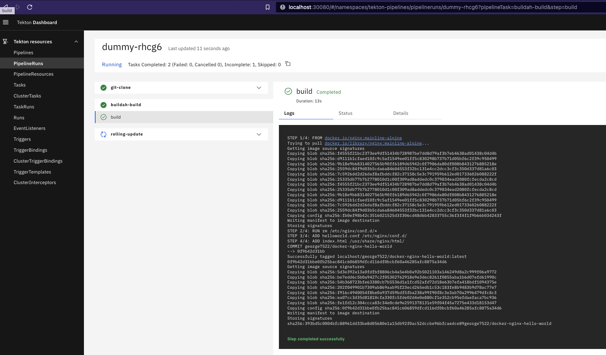

# Tekton pipeline to build and push docker image to Dockerhub using Buildah

Source repository https://github.com/cogitogroupltd/tekton-helm-chart

PreReqs:
- See [README.md](../../charts/tekton/README.md)

Description:

- Deploys a single Tekton pipeline called `prod` using `./values-override.yaml`
- Stages
  - `git-clone` - Clone down the application source code from GitHub containing a `Dockerfile`
  - `buildah-build-push` - Build the Dockerfile using Buildah and pushes it to Dockerhub using the credentials in `config.json`
  - `rolling-update` - Deploy the docker image artifact to your existing Kubernetes deployment
- Uses local RSA private key located in `.auth/id_rsa` for `git-clone` 
- Secures webhook to `EventListener` communication using a token specified in `.Values.github_token`




## Install the pipeline


- Deploy Tekton pipeline helm chart

- Ignore `github_token` if you are planning to manually trigger builds, see below for setting up Triggers `Run a pipeline via Trigger (requires additional configuration)`

- Beware this will create a secret in the cluster with the private SSH key located at `.auth/id_rsa`

- Enter your Dockerhub username/password credentials in place of $DOCKERHUB_USER and $DOCKERHUB_PASSWORD


```bash
cd examples/tekton-buildah-build-deploy
source ../../.auth/dockerhub.env
export SLACK_WEBHOOK_URI=https://hooks.slack.com/services/TJL9A5PMJ/B03KPQ2V4JG/DUMMY
export SSH_KEY_LOCATION=../../.auth/id_rsa
docker_auth="$(echo -n "${DOCKERHUB_USERNAME}":"${DOCKERHUB_PASSWORD}" | base64)"
tee "config.json" > /dev/null <<EOF
{"auths":{"https://index.docker.io/v1/":{"auth":"$docker_auth","email":"systems@cogitogroup.co.uk"}}}
EOF
helm upgrade --install pipelines -n tekton-pipelines ../../charts/tekton --set github_token="$(echo -n "ENTERTOKEN" | base64)" --set secret_ssh_key="$(cat $SSH_KEY_LOCATION)" --set-file=docker_config_json=config.json --values ./values-override.yaml
```


## Run a pipeline manually

```bash
cd examples/tekton-buildah-build-deploy
kubectl create -f pipelinerun.yaml
```

## View the Tekton dashboard

For more information on how to install and view the dashboard see the main [README.md](../../README.md)

- Install Dashboard

```bash
# See here for version list  https://github.com/tektoncd/dashboard/tags
kubectl apply --filename https://storage.googleapis.com/tekton-releases/dashboard/previous/v0.29.2/tekton-dashboard-release.yaml
```
- Wait for the pods to come up

```bash
kubectl get pod -n tekton-pipelines --watch
```

- Port-forward to the dashboard

```bash
kubectl port-forward svc/tekton-dashboard -n tekton-pipelines 8887:9097 &
```

- Open your browser and navigate to http://localhost:8887 -> PipelineRuns and select your running pipeline


## Run a pipeline via Trigger (requires additional configuration)

NOTE: If you are running locally you will need to configure inbound firewall rules on your router!

- Open inbound firewall rules to allow traffic from GitHub, see here https://docs.github.com/en/authentication/keeping-your-account-and-data-secure/about-githubs-ip-addresses)
- Open outbound firewall rules to allow traffic to GitHub, see here https://docs.github.com/en/authentication/keeping-your-account-and-data-secure/about-githubs-ip-addresses)
- Uncomment `.Values.services` in `values-override.yaml` and alter certificate ARN to expose your `EventListener` to GitHub on HTTPS
- Run install step above again and specify any `github_token` by replacing "ENTERTOKEN"
- Create public DNS entry for your new LoadBalancer resource eg. tekton.cogitogroup.co.uk

- Alter values in [_taskrun.yaml](../../charts/tekton/templates/create-webhook/_taskrun.yaml) according to your DNS entry, repository name.
- Create the webhook in Github

```bash
kubectl create -f ../../charts/tekton/templates/create-webhook/_taskrun.yaml
```
- Trigger push event using `git push` to repository defined in git-clone `./values-override.yaml` and 

or 

- Use an example github payload to test triggers locally (see Github -> Settings -> Webhooks -> Recent Deliveries) to export ane example `payload.json` (NOTE: This will not work if you have a webhook token setup and specified in `.Values.pipelines[0].trigger.token` )

```bash
kubectl run debug-pod --image=nginx 
kubectl cp payload.json debug-pod:/root/payload.json
kubectl exec -it debug-pod -- curl -X POST http://el-dev-listener.tekton-pipelines.svc.cluster.local:8080 -H 'X-GitHub-Event: pull_request' -d @/root/payload.json
```


## Uninstall

To uninstall the Tekton pipeline

```bash
helm delete pipelines -n tekton-pipelines
```